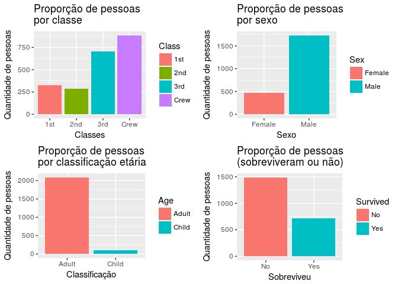
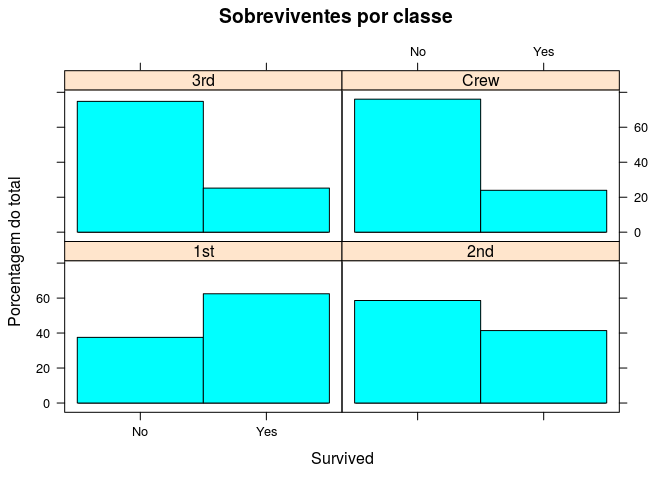
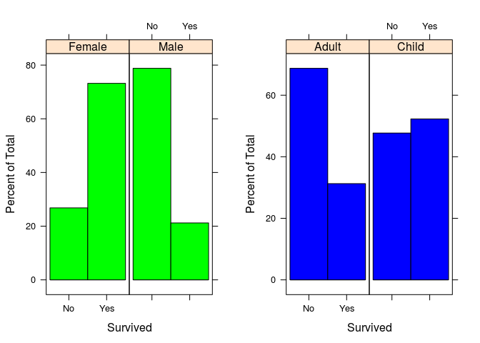
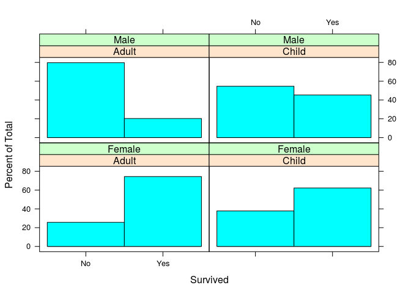
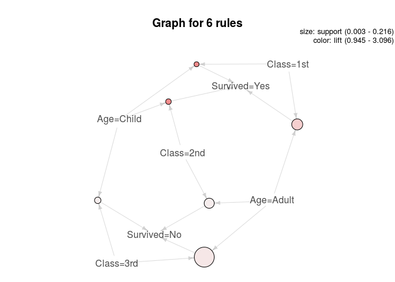

Análise de associação - Titanic
================

### Titanic Dataset - Survival of passengers on the Titanic

O dataset **Surivival of passengers on the Titanic** utilizado para esta analise fornece dados sobre 2201 passageiros envolvidos em um dos maiores acidentes maritimicos, o naufrágio do Titanic. O dataset (já carregado por padrão no package de datasets do R) pode ser encontrado através do comando:

``` r
data()
```

Mais informações a cerca do dataset podem ser encontradas [aqui!](https://stat.ethz.ch/R-manual/R-devel/library/datasets/html/Titanic.html)

Preparando o dataset
--------------------

A estrutura do dataset pode ser vista do seguinte modo:

``` r
data("Titanic") 
str(Titanic)
```

    ##  table [1:4, 1:2, 1:2, 1:2] 0 0 35 0 0 0 17 0 118 154 ...
    ##  - attr(*, "dimnames")=List of 4
    ##   ..$ Class   : chr [1:4] "1st" "2nd" "3rd" "Crew"
    ##   ..$ Sex     : chr [1:2] "Male" "Female"
    ##   ..$ Age     : chr [1:2] "Child" "Adult"
    ##   ..$ Survived: chr [1:2] "No" "Yes"

Temos então 5 variáveis sendo a classe do passageiro, o sexo, a classificação de idade, se sobreviveu e a frequência de cada passageiro caracterizado pela tupla. Para podermos realizar a mineração de regras de associação, primeiramente precisamos representrar devidamente cada passageiro (uma tupla para cada pessoa), além de transformar o dataset (que está em formato de tabela) em um dataframe.

``` r
titanic <- as.data.frame(Titanic)
titanic.df <- NULL # novo objeto para o dataframe pre-processado

for (i in 1:4) { # faz o bind de todas as 4 primeiras colunas do dataframe titanic
  titanic.df <- cbind(titanic.df, rep(as.character(titanic[,i]), titanic$Freq))
}

titanic.df <- as.data.frame(titanic.df) # converte em dataframe
names(titanic.df) <- names(titanic)[1:4]
```

Neste ponto já temos o dataframe ideal para a mineração de regras de associação.

Conhecendo melhor o contexto do dataframe gerado
------------------------------------------------

Antes de prosseguirmos com a análise de associação, é interessante criar mais intimidade com relação aos dados e o que eles podem nos dizer através de análises mais simples, como por exemplo responder as seguintes questões
1. Quantas pessoas haviam por classe?
2. Qual era a proporção entre mulheres e homens no navio?
3. Qual era a proporção entre crianças e adultos?
4. Qual a proporção entre os que conseguiram ou não sobreviver?

Essas perguntas são respondidas a seguir:

    ##   Class         Sex          Age       Survived  
    ##  1st :325   Female: 470   Adult:2092   No :1490  
    ##  2nd :285   Male  :1731   Child: 109   Yes: 711  
    ##  3rd :706                                        
    ##  Crew:885



Apenas analisando os histogramas, percebemos que a grande maioria da população que estava no navio eram homens adultos, além disso, **a quantidade de pessoas na 3ª classe é maior que a quantidade somada de pessoas na 1ª e 2ª**, fato este que pode ser extremamente relevante na mineração de regras, pois sabendo disso, hipotéticamente podemos esperar um maior número de mortes entre pessoas da 3ª classe do que entre pessoas da 1ª e 2ª.

O pacote lattice possui funções interessantes que nos auxiliam a visualizar melhor estes histogramas colocando algumas regras a mais na visualização, vejamos como o histograma que indica sobrevivencia se comporta ao refinarmos por classes:

``` r
library(lattice)
histogram(~Survived | Class, data=titanic.df, main="Sobreviventes por classe", ylab="Porcentagem do total")
```



O plot nos mostra que de todas as classes, aquela que teve a maior porcentagem total de sobreviventes foi a 1ª com aproximadamente 60% de seus integrantes sobrevivendo, logo após a 2ª classe com cerca de 40% e consecutivamente 3ª classe e equipe técnica com aproximadamente 20% de sobreviventes. Vale lembrar que a quantidade de pessoas por classe pode ter forte influência na % de sobreviventes, assim como já supracitado.

Podemos agora fazer o mesmo para sobreviventes por sexo e por classificação etária

``` r
h1 <- histogram(~Survived | Sex, data=titanic.df, col="green")
h2 <- histogram(~Survived | Age, data=titanic.df, col="blue")
grid.arrange(h1,h2,nrow=1, ncol=2)
```



Os plots nos mostram que a quantidade de homens que sobreviveram é notávelmente inferior a de mulheres, onde praticamente 80% das mulheres sobreviveram e apenas 20% dos homens. O plot do lado direito nos mostra que a proporção de crianças sobreviventes também é notávelmente superior a proporção de adultos. Todas essas informações nos indicam uma política onde é muito provável que mulheres adultas e crianças (de ambos os sexos) eram salvas com maior prioridade do que homens adultos.

Podemos refinar ainda mais os histogramas exibindo agora sobreviventes por classificação etária e sexo juntos:

``` r
histogram(~Survived | Age + Sex, data=titanic.df)
```



Com o novo histograma, temos uma concepção ainda mais clara da política supracitada.

Minerando Regras de associação
------------------------------

Com todo contexto visualizado acima, o leitor já pode ter uma noção de algumas regras que podem aparecer em nossa mineração.

Todavia, utilizaremos o pacote *arules* e *arulesViz* a nosso dataframe eliminando as redundâncias e obtendo apenas as regras mais relevantes, ou seja, aquelas que indicam sobrevivencia ou não:

``` r
library(arules)
```

    ## Loading required package: Matrix

    ## 
    ## Attaching package: 'arules'

    ## The following objects are masked from 'package:base':
    ## 
    ##     abbreviate, write

``` r
regras <- apriori(titanic.df, 
                 parameter = list(minlen=3, supp=0.002, conf=0.2),
                 appearance = list(rhs=c("Survived=Yes", "Survived=No"),
                                   lhs=c("Class=1st", "Class=2nd", "Class=3rd",
                                         "Age=Child", "Age=Adult"),
                                   default="none"), 
                 control = list(verbose=F))
quality(regras) <- round(quality(regras),4)
regras.sorted <- sort(regras, by="confidence")
inspect(regras.sorted)
```

    ##      lhs                      rhs            support confidence lift  
    ## [1]  {Class=2nd,Age=Child} => {Survived=Yes} 0.0109  1.0000     3.0956
    ## [2]  {Class=1st,Age=Child} => {Survived=Yes} 0.0027  1.0000     3.0956
    ## [3]  {Class=3rd,Age=Adult} => {Survived=No}  0.2163  0.7592     1.1214
    ## [4]  {Class=3rd,Age=Child} => {Survived=No}  0.0236  0.6582     0.9723
    ## [5]  {Class=2nd,Age=Adult} => {Survived=No}  0.0759  0.6398     0.9452
    ## [6]  {Class=1st,Age=Adult} => {Survived=Yes} 0.0895  0.6176     1.9117
    ## [7]  {Class=1st,Age=Adult} => {Survived=No}  0.0554  0.3824     0.5649
    ## [8]  {Class=2nd,Age=Adult} => {Survived=Yes} 0.0427  0.3602     1.1149
    ## [9]  {Class=3rd,Age=Child} => {Survived=Yes} 0.0123  0.3418     1.0580
    ## [10] {Class=3rd,Age=Adult} => {Survived=Yes} 0.0686  0.2408     0.7455
    ##      count
    ## [1]   24  
    ## [2]    6  
    ## [3]  476  
    ## [4]   52  
    ## [5]  167  
    ## [6]  197  
    ## [7]  122  
    ## [8]   94  
    ## [9]   27  
    ## [10] 151

A função apriori faz a mineração de regras retornando os indices de mensuração **support, confidence e lift**, neste caso, é interessante observar o indice **confidence**, por exemplo nas regras 1 e 2 que indicam que crianças da 1ª e 2ª classe sobrevivem, **confidence equivale a 1** o que indica que todas as crianças da primeira e da segunda classe sobreviveram. Infelizmente o mesmo não é válido para crianças da 3ª classe, observa-se que para esta regra, temos conficende igual a 0.3418, ou seja, a taxa de sobrevivência das crianças da 3ª classe equivale a 34% uma taxa bem próxima de adultos da segunda classe. As regras mineradas também nos mostram que a confiança da 6ª regra equivale a 24% , ou seja, em 24% das tuplas onde temos adultos da 3ª classe a variável de sobrevivência é positiva.

Podemos visualizar as regras de associação graficamente através de funções da biblioteca arulesViz:

``` r
library(arulesViz)
```

    ## Loading required package: grid

``` r
regras <- apriori(titanic.df, 
                 parameter = list(minlen=3, supp=0.002, conf=0.5),
                 appearance = list(rhs=c("Survived=Yes", "Survived=No"),
                                   lhs=c("Class=1st", "Class=2nd", "Class=3rd",
                                         "Age=Child", "Age=Adult"),
                                   default="none"), 
                 control = list(verbose=F))
quality(regras) <- round(quality(regras),4)
plot(regras, method="graph")
```


